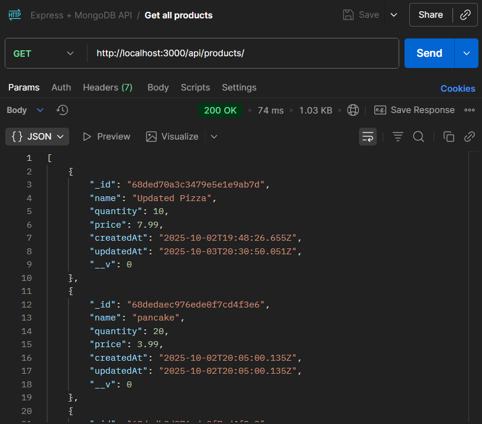
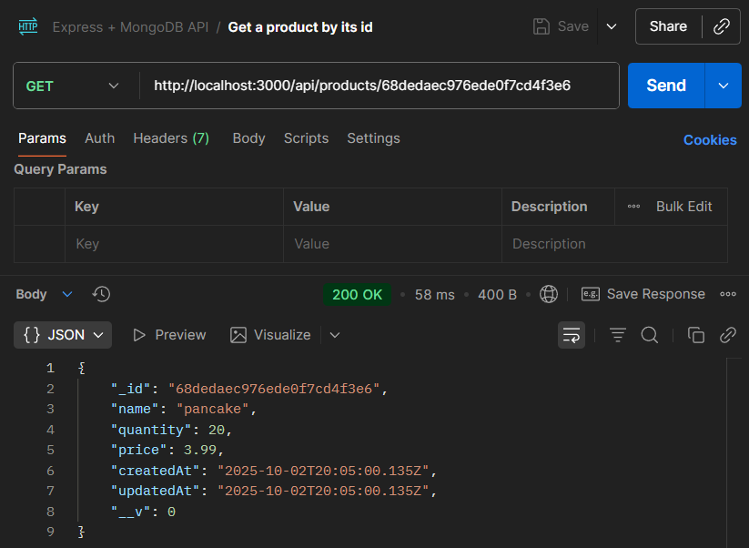
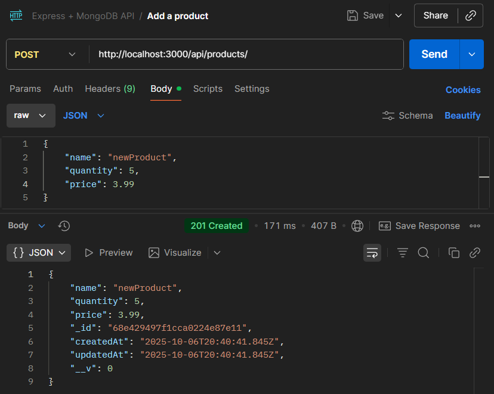
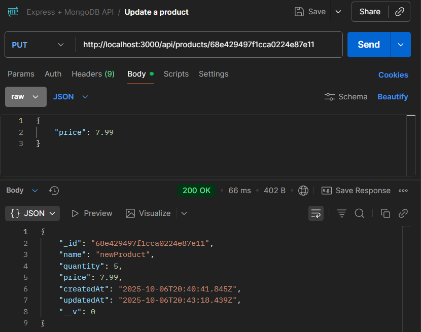
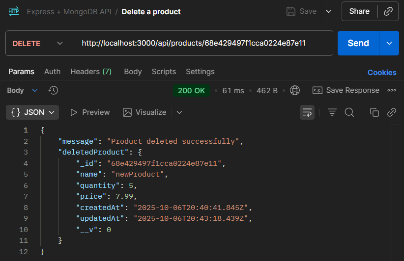

# 🧩 Express + Mongo CRUD API

A **RESTful CRUD API** built using **Node.js**, **Express**, and **MongoDB (Mongoose)**.  
This project provides endpoints to **create, read, update, and delete products**.  

---

## 🚀 Features

- Create, Read, Update, and Delete (CRUD) products  
- MongoDB Atlas connection via Mongoose  
- Environment variable configuration using `dotenv`  
- Error handling with proper HTTP status codes  
- JSON-based REST API responses

## ⚙️ Technologies Used

- **Node.js**  
- **Express.js**  
- **MongoDB** (via **Mongoose**)

## 📖 API Endpoints

| Method | Endpoint        | Description               | Request Body Example |
|--------|-----------------|---------------------------|--------------------|
| GET    | `/api/products`        | Get all products             | - |
| GET    | `/api/products/:id`    | Get a single product by ID   | - |
| POST   | `/api/products`        | Add a new product         | `{ "name": "Wireless Mouse", "quantity": 20, "price": 29.99, "image": "https://example.com/mouse.jpg" }` |
| PUT    | `/api/products/:id`    | Update an existing product   | `{ "name": "Updated Mouse", "quantity": 25, "price": 34.99, "image": "https://example.com/mouse2.jpg" }` |
| DELETE | `/api/products/:id`    | Delete a product by ID       | - |

## 🧪 Example Usage with Postman

**Get All Products:**



**Get a Product by ID:**



**Add a Product:**



**Update an Existing Product:**



**Delete a Product by ID:**



## 📦 Installation & Setup

1. **Clone the repository**
   ```bash
   git clone https://github.com/AryanPatel1918/express-mongo-crud-api.git
   cd express-mongo-crud-api
   ```

2. **Install dependencies**
    ```bash
    npm install
    ```

3. **Create a .env file in the root directory**
    ```bash
    MONGO_URI=your_mongodb_connection_string
    ```

4. **Start the development server**
    ```bash
    npm run dev
    ```

5. **The server will run at**
    ```bash
    http://localhost:3000
    ```